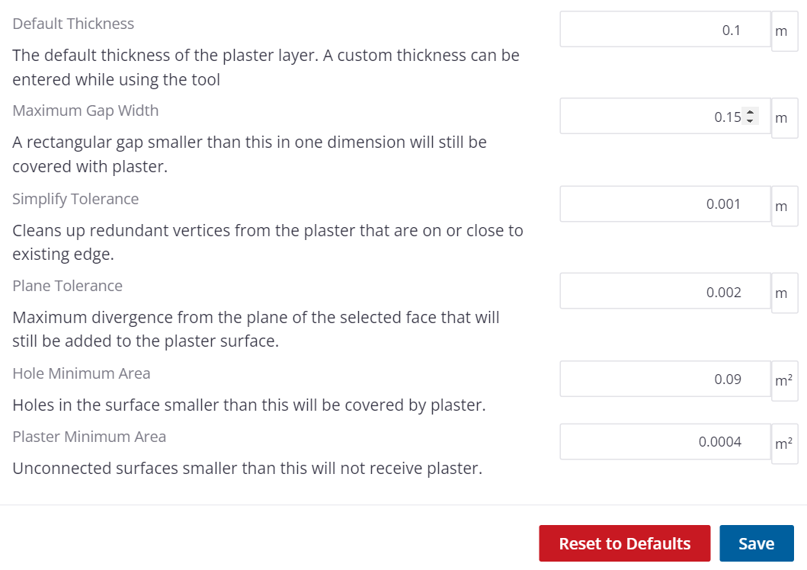

# Plaster Plugin for SketchUp

A custom tool that generates solid plaster geometry for a wall consisting of many parts.
A face can be selected to determine the plane of the plaster and all other visible geometry in the model is used to determine where to plaster and where are holes in the plaster.

Download the [latest release](https://github.com/wheerd/sketchup-plaster-plugin/releases/latest)

